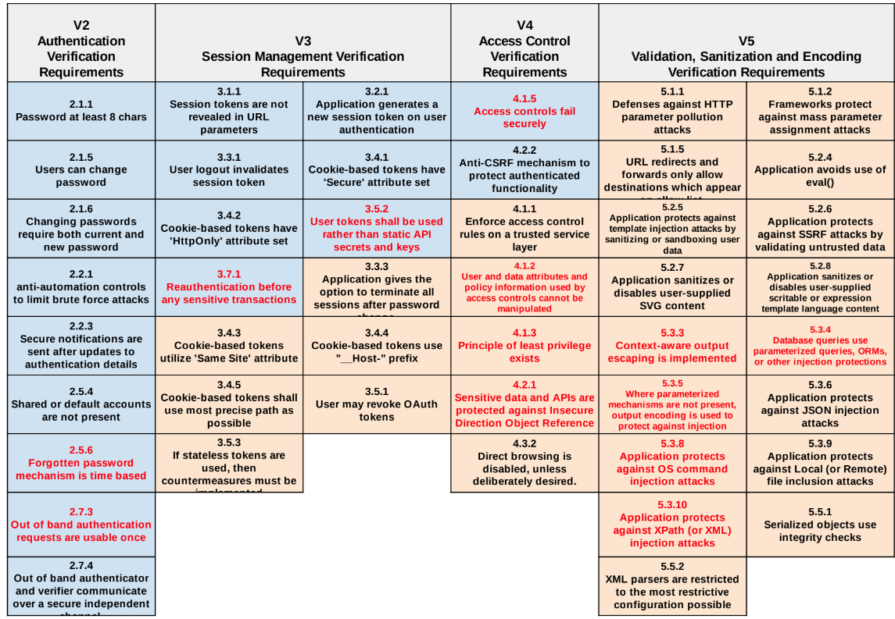
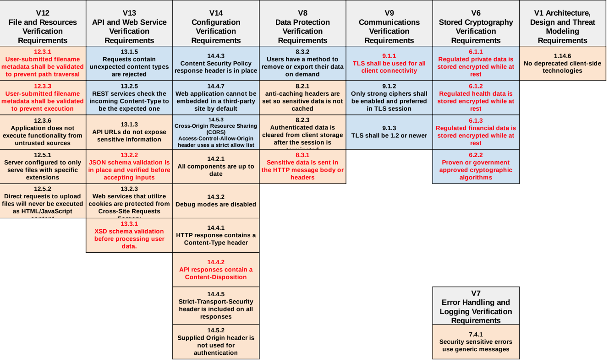

# Application Defense Alliance Cloud Security Guide 1.01

Items in Red are related to High Likelihood CWEs as defined by MITRE.

|Sub Category                                   |Full Assessment|Base Assessment|Self Assesment|ASVS Control|Testing Requirements                                                                                                                                                                                                                                                                                                                                                                                                                                                                                                               |
|-----------------------------------------------|---------------|---------------|--------------|------------|-----------------------------------------------------------------------------------------------------------------------------------------------------------------------------------------------------------------------------------------------------------------------------------------------------------------------------------------------------------------------------------------------------------------------------------------------------------------------------------------------------------------------------------|
|V1 Configuration Architecture                  |M              |               |              |1.14.6      |Verify the application does not use unsupported, insecure, or deprecated client-side technologies such as NSAPI plugins, Flash, Shockwave, ActiveX, Silverlight, NACL, or client-side Java applets.                                                                                                                                                                                                                                                                                                                                |
|V2 Password Security                           |M              |M              |M             |2.1.1       |Verify that user set passwords are at least 8 characters in length. (C6)                                                                                                                                                                                                                                                                                                                                                                                                                     |
|V2 Password Security                           |M              |M              |M             |2.1.5       |Verify users can change their password.                                                                                                                                                                                                                                                                                                                                                                                                                                                                                            |
|V2 Password Security                           |M              |M              |M             |2.1.6       |Verify that password change functionality requires the user's current and new password.                                                                                                                                                                                                                                                                                                                                                                                                                                            |
|V2 General Authenticator Security              |M              |M              |M             |2.2.1       |Verify that anti-automation controls are effective at mitigating breached credential testing, brute force, and account lockout attacks. Such controls include blocking the most common breached passwords, soft lockouts, rate limiting, CAPTCHA, ever increasing delays between attempts, IP address restrictions, or risk-based restrictions such as location, first login on a device, recent attempts to unlock the account, or similar. Verify that no more than 100 failed attempts per hour is possible on a single account.|
|V2 General Authenticator Security              |M              |               |              |2.2.3        |Verify that users are notified after updates to authentication details, credential resets or modification of the username or email address. (Note: This is a simplification of the OWASP Spec)                                                                                                               |
|V2 Credential Recovery                         |M              |               |              |2.5.4       |Verify shared or default accounts are not present (e.g. "root", "admin", or "sa").                                                                                                                                                                                                                                                                                                                                                                                                                                                 |
|V2 Credential Recovery                         |M              |               |              |2.5.6       |Verify forgotten password, and other recovery paths use a secure recovery mechanism, such as time-based OTP (TOTP) or other soft token, mobile push, or another offline recovery mechanism. (C6)                                                                                                                                                                                                                                                                                                                                   |
|V2 Out of Band Verifier                        |M              |               |              |2.7.3       |Verify that the out of band verifier authentication requests, codes, or tokens are only usable once, and only for the original authentication request.                                                                                                                                                                                                                                                                                                                                                                             |
|V2 Out of Band Verifier                        |M              |               |              |2.7.4       |Verify that the out of band authenticator and verifier communicates over a secure independent channel.                                                                                                                                                                                                                                                                                                                                                                                                                             |
|V3 Fundamental Session Management Security     |M              |M              |M             |3.1.1       |Verify the application never reveals session tokens in URL parameters.                                                                                                                                                                                                                                                                                                                                                                                                                                                             |
|V3 Session Binding                             |M              |M              |M             |3.2.1       |Verify the application generates a new session token on user authentication. (C6)                                                                                                                                                                                                                                                                                                                                                                                                                                                  |
|V3 Session Termination                         |M              |M              |M             |3.3.1       |Verify that logout and expiration invalidate the session token, such that the back button or a downstream relying party does not resume an authenticated session, including across relying parties. (C6)                                                                                                                                                                                                                                                                                                                           |
|V3 Session Termination                         |M              |               |              |3.3.3       |Verify that the application gives the option to terminate all other active sessions after a successful password change (including change via password reset/recovery), and that this is effective across the application, federated login (if present), and any relying parties.                                                                                                                                                                                                                                                   |
|V3 Cookie-based Session Management             |M              |M              |M             |3.4.1       |Verify that cookie-based session tokens have the 'Secure' attribute set. (C6)                                                                                                                                                                                                                                                                                                                                                                                                                                                      |
|V3 Cookie-based Session Management             |M              |M              |M             |3.4.2       |Verify that cookie-based session tokens have the 'HttpOnly' attribute set. (C6)                                                                                                                                                                                                                                                                                                                                                                                                                                                    |
|V3 Cookie-based Session Management             |M              |               |              |3.4.3       |Verify that cookie-based session tokens utilize the 'Same Site' attribute to limit exposure to cross-site request forgery attacks. (C6)                                                                                                                                                                                                                                                                                                                                                                                            |
|V3 Cookie-based Session Management             |M              |               |              |3.4.4       |Verify that cookie-based session tokens use the "__Host-" prefix so cookies are only sent to the host that initially set the cookie.                                                                                                                                                                                                                                                                                                                                                                                               |
|V3 Cookie-based Session Management             |M              |               |              |3.4.5       |Verify that if the application is published under a domain name with other applications that set or use session cookies that might disclose the session cookies, set the path attribute in cookie-based session tokens using the most precise path possible. (C6)                                                                                                                                                                                                                                                                  |
|V3 Token-based Session Management              |M              |               |              |3.5.1       |Verify that the application allows users to revoke OAuth tokens that form trust relationships with linked applications.                                                                                                                                                                                                                                                         |
|V3 Token-based Session Management              |M              |M              |M             |3.5.2       |Verify the application uses session tokens rather than static API secrets and keys, except with legacy implementations.                                                                                                                                                                                                                                                                                                                                                                                                            |
|V3 Token-based Session Management              |M              |               |              |3.5.3       |Verify that stateless session tokens use digital signatures, encryption, and other countermeasures to protect against tampering, enveloping, replay, null cipher, and key substitution attacks.                                                                                                                                                                                                                                                                                                                                    |
|V3 Defenses Against Session Management Exploits|M              |M              |M             |3.7.1       |Verify the application ensures a full, valid login session or requires re-authentication or secondary verification before allowing any sensitive transactions or account modifications.                                                                                                                                                                                                                                                                                                                                            |
|V4 General Access Control Design               |M              |               |              |4.1.1       |Verify that the application enforces access control rules on a trusted service layer, especially if client-side access control is present and could be bypassed.                                                                                                                                                                                                                                                                                                                                                                   |
|V4 General Access Control Design               |M              |               |              |4.1.2       |Verify that all user and data attributes and policy information used by access controls cannot be manipulated by end users unless specifically authorized.                                                                                                                                                                                                                                                                                                                                                                         |
|V4 General Access Control Design               |M              |               |              |4.1.3       |Verify that the principle of least privilege exists - users should only be able to access functions, data files, URLs, controllers, services, and other resources, for which they possess specific authorization. This implies protection against spoofing and elevation of privilege. (C7)                                                                                                                                                                                                                                        |
|V4 General Access Control Design               |M              |M              |M             |4.1.5       |Verify that access controls fail securely including when an exception occurs. (C10)                                                                                                                                                                                                                                                                                                                                                                                                                                                |
|V4 Operation Level Access Control              |M              |               |              |4.2.1       |Verify that sensitive data and APIs are protected against Insecure Direct Object Reference (IDOR) attacks targeting creation, reading, updating and deletion of records, such as creating or updating someone else's record, viewing everyone's records, or deleting all records.                                                                                                                                                                                                                                                  |
|V4 Operation Level Access Control              |M              |M              |M             |4.2.2       |Verify that the application or framework enforces a strong anti-CSRF mechanism to protect authenticated functionality, and effective anti-automation or anti-CSRF protects unauthenticated functionality.                                                                                                                                                                                                                                                                                                                          |
|V4 Other Access Control Considerations         |M              |               |              |4.3.2       |Verify that directory browsing is disabled unless deliberately desired. Additionally, applications should not allow discovery or disclosure of file or directory metadata, such as Thumbs.db, .DS_Store, .git or .svn folders.                                                                                                                                                                                                                                                                                                     |
|V5 Input Validation                            |M              |               |              |5.1.1       |Verify that the application has defenses against HTTP parameter pollution attacks, particularly if the application framework makes no distinction about the source of request parameters (GET, POST, cookies, headers, or environment variables).                                                                                                                                                                                                                                                                                  |
|V5 Input Validation                            |M              |               |              |5.1.2       |Verify that frameworks protect against mass parameter assignment attacks, or that the application has countermeasures to protect against unsafe parameter assignment, such as marking fields private or similar. (C5)                                                                                                                                                                                                                                                                                                              |
|V5 Input Validation                            |M              |               |              |5.1.5       |Verify that URL redirects and forwards only allow destinations which appear on an allow list, or show a warning when redirecting to potentially untrusted content.                                                                                                                                                                                                                                                                                                                                                                 |
|V5 Sanitization and Sandboxing                 |M              |               |              |5.2.4       |Verify that the application avoids the use of eval() or other dynamic code execution features. Where there is no alternative, any user input being included must be sanitized or sandboxed before being executed.                                                                                                                                                                                                                                                                                                                  |
|V5 Sanitization and Sandboxing                 |M              |               |              |5.2.5       |Verify that the application protects against template injection attacks by ensuring that any user input being included is sanitized or sandboxed.                                                                                                                                                                                                                                                                                                                                                                                  |
|V5 Sanitization and Sandboxing                 |M              |               |              |5.2.6       |Verify that the application protects against SSRF attacks, by validating or sanitizing untrusted data or HTTP file metadata, such as filenames and URL input fields, and uses allow lists of protocols, domains, paths and ports.                                                                                                                                                                                                                                                                                                  |
|V5 Sanitization and Sandboxing                 |M              |               |              |5.2.7       |Verify that the application sanitizes, disables, or sandboxes user-supplied Scalable Vector Graphics (SVG) scriptable content, especially as they relate to XSS resulting from inline scripts, and foreignObject.                                                                                                                                                                                                                                                                                                                  |
|V5 Sanitization and Sandboxing                 |M              |               |              |5.2.8       |Verify that the application sanitizes, disables, or sandboxes user-supplied scriptable or expression template language content, such as Markdown, CSS or XSL stylesheets, BBCode, or similar.                                                                                                                                                                                                                                                                                                                                      |
|V5 Output Encoding and Injection Protection    |M              |               |              |5.3.3       |Verify that context-aware, preferably automated - or at worst, manual - output escaping protects against reflected, stored, and DOM based XSS. (C4)                                                                                                                                                                                                                                                                                                                                                                                |
|V5 Output Encoding and Injection Protection    |M              |               |              |5.3.4       |Verify that data selection or database queries (e.g. SQL, HQL, ORM, NoSQL) use parameterized queries, ORMs, entity frameworks, or are otherwise protected from database injection attacks. (C3)                                                                                                                                                                                                                                                                                                                                    |
|V5 Output Encoding and Injection Protection    |M              |               |              |5.3.5       |Verify that where parameterized or safer mechanisms are not present, context-specific output encoding is used to protect against injection attacks, such as the use of SQL escaping to protect against SQL injection. (C3, C4)                                                                                                                                                                                                                                                                                                     |
|V5 Output Encoding and Injection Protection    |M              |               |              |5.3.6       |Verify that the application protects against JSON injection attacks, JSON eval attacks, and JavaScript expression evaluation. (C4)                                                                                                                                                                                                                                                                                                                                                                                                 |
|V5 Output Encoding and Injection Protection    |M              |               |              |5.3.8       |Verify that the application protects against OS command injection and that operating system calls use parameterized OS queries or use contextual command line output encoding. (C4)                                                                                                                                                                                                                                                                                                                                                |
|V5 Output Encoding and Injection Protection    |M              |               |              |5.3.9       |Verify that the application protects against Local File Inclusion (LFI) or Remote File Inclusion (RFI) attacks.                                                                                                                                                                                                                                                                                                                                                                                                                    |
|V5 Output Encoding and Injection Protection    |M              |               |              |5.3.10      |Verify that the application protects against XPath injection or XML injection attacks. (C4)                                                                                                                                                                                                                                                                                                                                                                                                                                        |
|V5 Deserialization Prevention                  |M              |               |              |5.5.1       |Verify that serialized objects use integrity checks or are encrypted to prevent hostile object creation or data tampering. (C5)                                                                                                                                                                                                                                                                                                                                                                                                    |
|V5 Deserialization Prevention                  |M              |               |              |5.5.2       |Verify that the application correctly restricts XML parsers to only use the most restrictive configuration possible and to ensure that unsafe features such as resolving external entities are disabled to prevent XML eXternal Entity (XXE) attacks.                                                                                                                                                                                                                                                                              |
|V6 Stored Cryptography                              |M              |M               |M              |6.1.1       |Verify that regulated private data is stored encrypted while at rest, such as Personally Identifiable Information (PII), sensitive personal information, or data assessed likely to be subject to EU's GDPR.|
|V6 Stored Cryptography                              |M              |M               |M              |6.1.2       |Verify that regulated health data is stored encrypted while at rest, such as medical records, medical device details, or de-anonymized research records.|
|V6 Stored Cryptography                              |M              |M               |M              |6.1.3       |Verify that regulated financial data is stored encrypted while at rest, such as financial accounts, defaults or credit history, tax records, pay history, beneficiaries, or de-anonymized market or research records.|
|V6 Stored Cryptography                              |M              |M               |M              |6.2.2       |Verify that industry proven or government approved cryptographic algorithms, modes, and libraries are used, instead of custom coded cryptography.|
|V7 Error Handling                              |M              |               |              |7.4.1       |Verify that a generic message is shown when an unexpected or security sensitive error occurs, potentially with a unique ID which support personnel can use to investigate. (C10)                                                                                                                                                                                                                                                                                                                                                   |
|V8 Client-Side Data Protection                 |M              |               |              |8.2.1       |Verify the application sets sufficient anti-caching headers so that sensitive data is not cached in modern browsers.                                                                                                                                                                                                                                                                                                                                                                                                               |
|V8 Client-Side Data Protection                 |M              |               |              |8.2.3       |Verify that authenticated data is cleared from client storage, such as the browser DOM, after the client or session is terminated.                                                                                                                                                                                                                                                                                                                                                                                                 |
|V8 Sensitive Private Data                      |M              |               |              |8.3.1       |Verify that sensitive data is sent to the server in the HTTP message body or headers, and that query string parameters from any HTTP verb do not contain sensitive data.                                                                                                                                                                                                                                                                                                                                                           |
|V8 Sensitive Private Data                      |M              |M              |M             |8.3.2       |Verify that users have a method to remove or export their data on demand.                                                                                                                                                                                                                                                                                                                                                                                                                                                          |
|V9 Client Communication Security               |M              | M              |M              |9.1.1       |Verify that TLS is used for all client connectivity, and does not fall back to insecure or unencrypted communications. (C8)                                                                                                                                                                                                                                                                                                                                                                                                        |
|V9 Client Communication Security               |M              |M              |M             |9.1.2       |Verify using up to date TLS testing tools that only strong cipher suites are enabled, with the strongest cipher suites set as preferred.                                                                                                                                                                                                                                                                                                                                                                                           |
|V9 Client Communication Security               |M              |M              |M             |9.1.3       |Verify that only the latest recommended versions of the TLS protocol are enabled, such as TLS 1.2 and TLS 1.3. The latest version of the TLS protocol should be the preferred option.                                                                                                                                                                                                                                                                                                                                              |
|V12 File Integrity                             |M              |               |              |12.3.1      |Verify that user-submitted filename metadata is not used directly by system or framework filesystems and that a URL API is used to protect against path traversal.                                                                                                                                                                                                                                                                                                                                                                 |
|V12 File Execution                             |M              |               |              |12.3.3      |Verify that user-submitted filename metadata is validated or ignored to prevent the disclosure or execution of remote files via Remote File Inclusion (RFI) or Server-side Request Forgery (SSRF) attacks.                                                                                                                                                                                                                                                                                                                         |
|V12 File Execution                             |M              |               |              |12.3.6      |Verify that the application does not include and execute functionality from untrusted sources, such as unverified content distribution networks, JavaScript libraries, node npm libraries, or server-side DLLs.                                                                                                                                                                                                                                                                                                                    |
|V12 File Download                              |M              |               |              |12.5.1      |Verify that the web tier is configured to serve only files with specific file extensions to prevent unintentional information and source code leakage. For example, backup files (e.g. .bak), temporary working files (e.g. .swp), compressed files (.zip, .tar.gz, etc) and other extensions commonly used by editors should be blocked unless required.                                                                                                                                                                          |
|V12 File Download                              |M              |               |              |12.5.2      |Verify that direct requests to uploaded files will never be executed as HTML/JavaScript content.                                                                                                                                                                                                                                                                                                                                                                                                                                   |
|V13 Generic Web Service Security               |M              |               |              |13.1.3      |Verify API URLs do not expose sensitive information, such as the API key, session tokens etc.                                                                                                                                                                                                                                                                                                                                                                                                                                      |
|V13 Generic Web Service Security               |M              |M              |M             |13.1.5      |Verify that requests containing unexpected or missing content types are rejected with appropriate headers (HTTP response status 406 Unacceptable or 415 Unsupported Media Type).                                                                                                                                                                                                                                                                                                                                                   |
|V13 RESTful Web Service                        |M              |               |              |13.2.2      |Verify that JSON schema validation is in place and verified before accepting input.                                                                                                                                                                                                                                                                                                                                                                                                                                                |
|V13 RESTful Web Service                        |M              |               |              |13.2.3      |Verify that RESTful web services that utilize cookies are protected from Cross-Site Request Forgery via the use of at least one or more of the following: double submit cookie pattern, CSRF nonces, or Origin request header checks.                                                                                                                                                                                                                                                                                              |
|V13 RESTful Web Service                        |M              |M              |M             |13.2.5      |Verify that REST services explicitly check the incoming Content-Type to be the expected one, such as application/xml or application/json.                                                                                                                                                                                                                                                                                                                                                                                          |
|V13 SOAP Web Service                           |M              |               |              |13.3.1      |Verify that XSD schema validation takes place to ensure a properly formed XML document, followed by validation of each input field before any processing of that data takes place.                                                                                                                                                                                                                                                                                                                                                 |
|V14 Dependency                                 |M              |               |              |14.2.1      |Verify that all components are up to date, preferably using a dependency checker during build or compile time. (C2)                                                                                                                                                                                                                                                                                                                                                                                                                |
|V14 Unintended Security Disclosure             |M              |               |              |14.3.2      |Verify that web or application server and application framework debug modes are disabled in production to eliminate debug features, developer consoles, and unintended security disclosures.                                                                                                                                                                                                                                                                                                                                       |
|V14 Unintended Security Disclosure             |M              |               |              |14.4.1      |Verify that every HTTP response contains a Content-Type header. Also specify a safe character set (e.g., UTF-8, ISO-8859-1) if the content types are text/*, /+xml and application/xml. Content must match with the provided Content-Type header.                                                                                                                                                                                                                                                                                  |
|V14 Unintended Security Disclosure             |M              |               |              |14.4.2      |Verify that all API responses contain a Content-Disposition: attachment; filename="api.json" header (or other appropriate filename for the content type).                                                                                                                                                                                                                                                                                                                                                                          |
|V14 Unintended Security Disclosure             |M              |M              |M             |14.4.3      |Verify that a Content Security Policy (CSP) response header is in place that helps mitigate impact for XSS attacks like HTML, DOM, JSON, and JavaScript injection vulnerabilities.                                                                                                                                                                                                                                                                                                                                                 |
|V14 Unintended Security Disclosure             |M              |               |              |14.4.5      |Verify that a Strict-Transport-Security header is included on all responses and for all subdomains, such as Strict-Transport-Security: max-age=15724800; includeSubdomains.                                                                                                                                                                                                                                                                                                                                                        |
|V14 Unintended Security Disclosure             |M              |M              |M             |14.4.7      |Verify that the content of a web application cannot be embedded in a third-party site by default and that embedding of the exact resources is only allowed where necessary by using suitable Content-Security-Policy: frame-ancestors and X-Frame-Options response headers.                                                                                                                                                                                                                                                        |
|V14 HTTP Security Headers                      |M              |               |              |14.5.2      |Verify that the supplied Origin header is not used for authentication or access control decisions, as the Origin header can easily be changed by an attacker.                                                                                                                                                                                                                                                                                                                                                                      |
|V14 HTTP Security Headers                      |M              |M              |M             |14.5.3      |Verify that the Cross-Origin Resource Sharing (CORS) Access-Control-Allow-Origin header uses a strict allow list of trusted domains and subdomains to match against and does not support the "null" origin.
