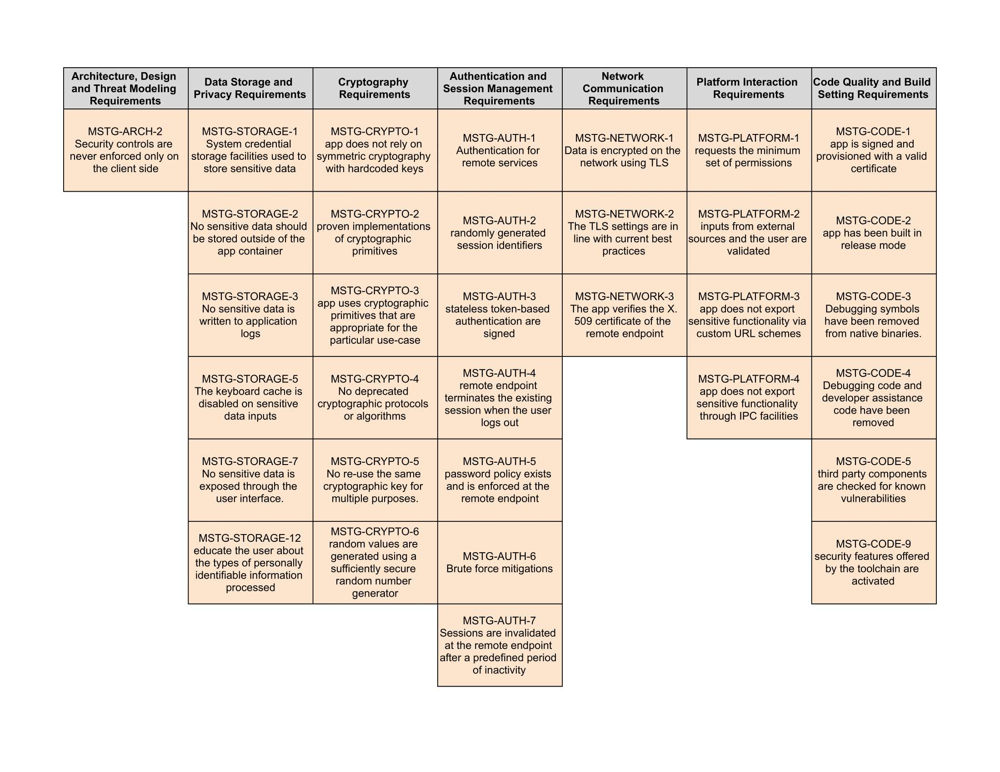

# Application Defense Alliance Mobile Security Guide

## Version History
| Version | Date | Descirption |
| ---- | ---- | ---------------- |
| 1.0 | 11/15/2021 | Initial version based on OWASP MASVS version 1.3 and MSTG Version 1.2 |
| 1.1 | 1/11/2022 | No change to ADA specifications. OWASP MASVS updated to version 1.4 and MSTG updated to version 1.3 |

## [V1: Architecture, Design and Threat Modeling Requirements](https://github.com/OWASP/owasp-masvs/blob/v1.4.0/Document/0x06-V1-Architecture_design_and_threat_modelling_requireme.md)
| ID | MSTG-ID | Description | Test Procedures |
| -- | ---------- | ---------------------- | -------- |
| 1.2 | MSTG-ARCH-2 | Security controls are never enforced only on the client side, but on the respective remote endpoints. | [Injection Flaws](https://github.com/OWASP/owasp-mstg/blob/v1.3.0/Document/0x04h-Testing-Code-Quality.md#injection-flaws-mstg-arch-2-and-mstg-platform-2)   [Verifying that Appropriate Authentication is in Place](https://github.com/OWASP/owasp-mstg/blob/v1.3.0/Document/0x04e-Testing-Authentication-and-Session-Management.md#verifying-that-appropriate-authentication-is-in-place-mstg-arch-2-and-mstg-auth-1)|

## [V2: Data Storage and Privacy Requirements](https://github.com/OWASP/owasp-masvs/blob/v1.4.0/Document/0x07-V2-Data_Storage_and_Privacy_requirements.md)
| ID | MSTG-ID | Description | Test Procedures |
| -- | ---------- | ---------------------- | -------- |
| 2.1 | MSTG-STORAGE-1 | System credential storage facilities need to be used to store sensitive data, such as PII, user credentials or cryptographic keys.| [Testing Local Storage for Sensitive Data](https://github.com/OWASP/owasp-mstg/blob/v1.3.0/Document/0x05d-Testing-Data-Storage.md#testing-local-storage-for-sensitive-data-mstg-storage-1-and-mstg-storage-2)  [Testing Key Management](https://github.com/OWASP/owasp-mstg/blob/v1.3.0/Document/0x05e-Testing-Cryptography.md#testing-key-management-mstg-storage-1-mstg-crypto-1-and-mstg-crypto-5) |
| 2.2 | MSTG-STORAGE-2 | No sensitive data should be stored outside of the app container or system credential storage facilities. | [Testing Local Storage for Sensitive Data ](https://github.com/OWASP/owasp-mstg/blob/v1.3.0/Document/0x05d-Testing-Data-Storage.md#testing-local-storage-for-sensitive-data-mstg-storage-1-and-mstg-storage-2)|
| 2.3 | MSTG-STORAGE-3 | No sensitive data is written to application logs. | [Testing Logs for Sensitive Data](https://github.com/OWASP/owasp-mstg/blob/v1.3.0/Document/0x05d-Testing-Data-Storage.md#testing-logs-for-sensitive-data-mstg-storage-3) |
| 2.5 | MSTG-STORAGE-5 | The keyboard cache is disabled on text inputs that process sensitive data. | [Determining Whether the Keyboard Cache Is Disabled for Text Input Fields](https://github.com/OWASP/owasp-mstg/blob/v1.3.0/Document/0x05d-Testing-Data-Storage.md#determining-whether-the-keyboard-cache-is-disabled-for-text-input-fields-mstg-storage-5)|
| 2.7 | MSTG-STORAGE-7 | No sensitive data, such as passwords or pins, is exposed through the user interface. | [Checking for Sensitive Data Disclosure Through the User Interface](https://github.com/OWASP/owasp-mstg/blob/v1.3.0/Document/0x05d-Testing-Data-Storage.md#checking-for-sensitive-data-disclosure-through-the-user-interface-mstg-storage-7)|
| 2.12 | MSTG-STORAGE-12 | The app educates the user about the types of personally identifiable information processed, as well as security best practices the user should follow in using the app. | [Testing User Education](https://github.com/OWASP/owasp-mstg/blob/v1.3.0/Document/0x04i-Testing-User-Privacy-Protection.md) |

## [V3: Cryptography Requirements](https://github.com/OWASP/owasp-masvs/blob/v1.4.0/Document/0x08-V3-Cryptography_Verification_Requirements.md)
| ID | MSTG-ID | Description | Test Procedures |
| -- | ---------- | ---------------------- | -------- |
| 3.1 | MSTG-CRYPTO-1 | The app does not rely on symmetric cryptography with hardcoded keys as a sole method of encryption. | [Testing Key Management](https://github.com/OWASP/owasp-mstg/blob/v1.3.0/Document/0x05e-Testing-Cryptography.md#testing-key-management-mstg-storage-1-mstg-crypto-1-and-mstg-crypto-5) |
| 3.2 | MSTG-CRYPTO-2 | The app uses proven implementations of cryptographic primitives. | [Common Configuration Issues](https://github.com/OWASP/owasp-mstg/blob/v1.3.0/Document/0x04g-Testing-Cryptography.md#common-configuration-issues-mstg-crypto-1-mstg-crypto-2-and-mstg-crypto-3)  [Testing the Configuration of Cryptographic Standard Algorithms](https://github.com/OWASP/owasp-mstg/blob/v1.3.0/Document/0x05e-Testing-Cryptography.md#testing-the-configuration-of-cryptographic-standard-algorithms-mstg-crypto-2-mstg-crypto-3-and-mstg-crypto-4)|
| 3.3 | MSTG-CRYPTO-3 | The app uses cryptographic primitives that are appropriate for the particular use-case, configured with parameters that adhere to industry best practices. | [Testing the Configuration of Cryptographic Standard Algorithms](https://github.com/OWASP/owasp-mstg/blob/v1.3.0/Document/0x05e-Testing-Cryptography.md#testing-the-configuration-of-cryptographic-standard-algorithms-mstg-crypto-2-mstg-crypto-3-and-mstg-crypto-4)  [Common Configuration Issues](https://github.com/OWASP/owasp-mstg/blob/v1.3.0/Document/0x04g-Testing-Cryptography.md#common-configuration-issues-mstg-crypto-1-mstg-crypto-2-and-mstg-crypto-3) |
| 3.4 | MSTG-CRYPTO-4 | The app does not use cryptographic protocols or algorithms that are widely considered deprecated for security purposes. | [Identifying Insecure and/or Deprecated Cryptographic Algorithms](https://github.com/OWASP/owasp-mstg/blob/v1.3.0/Document/0x04g-Testing-Cryptography.md#identifying-insecure-andor-deprecated-cryptographic-algorithms-mstg-crypto-4)  [Testing the Configuration of Cryptographic Standard Algorithms](https://github.com/OWASP/owasp-mstg/blob/v1.3.0/Document/0x05e-Testing-Cryptography.md#testing-the-configuration-of-cryptographic-standard-algorithms-mstg-crypto-2-mstg-crypto-3-and-mstg-crypto-4)|
| 3.5 | MSTG-CRYPTO-5 | The app does not re-use the same cryptographic key for multiple purposes. | [Testing Key Management](https://github.com/OWASP/owasp-mstg/blob/v1.3.0/Document/0x05e-Testing-Cryptography.md#testing-key-management-mstg-storage-1-mstg-crypto-1-and-mstg-crypto-5)|
| 3.6 | MSTG-CRYPTO-6 | All random values are generated using a sufficiently secure random number generator. | [Testing Random Number Generation](https://github.com/OWASP/owasp-mstg/blob/v1.3.0/Document/0x05e-Testing-Cryptography.md#testing-random-number-generation-mstg-crypto-6)|

## [V4: Authentication and Session Management Requirements](https://github.com/OWASP/owasp-masvs/blob/v1.4.0/Document/0x09-V4-Authentication_and_Session_Management_Requirements.md)
| ID | MSTG-ID | Description | Test Procedures |
| -- | ---------- | ---------------------- | -------- |
| 4.1 | MSTG-AUTH-1 | If the app provides users access to a remote service, some form of authentication, such as username/password authentication, is performed at the remote endpoint. | [Testing Confirm Credentials](https://github.com/OWASP/owasp-mstg/blob/v1.3.0/Document/0x05f-Testing-Local-Authentication.md#testing-confirm-credentials-mstg-auth-1-and-mstg-storage-11)  [Verifying that Appropriate Authentication is in Place](https://github.com/OWASP/owasp-mstg/blob/v1.3.0/Document/0x04e-Testing-Authentication-and-Session-Management.md#verifying-that-appropriate-authentication-is-in-place-mstg-arch-2-and-mstg-auth-1)  [Testing OAuth 2.0 Flows](https://github.com/OWASP/owasp-mstg/blob/v1.3.0/Document/0x04e-Testing-Authentication-and-Session-Management.md#testing-oauth-20-flows-mstg-auth-1-and-mstg-auth-3) |
| 4.2 | MSTG-AUTH-2 | If stateful session management is used, the remote endpoint uses randomly generated session identifiers to authenticate client requests without sending the users credentials. | [Testing Stateful Session Management](https://github.com/OWASP/owasp-mstg/blob/v1.3.0/Document/0x04e-Testing-Authentication-and-Session-Management.md#testing-stateful-session-management-mstg-auth-2)|
| 4.3 | MSTG-AUTH-3 | If stateless token-based authentication is used, the server provides a token that has been signed using a secure algorithm. | [Testing Stateless (Token-Based) Authentication](https://github.com/OWASP/owasp-mstg/blob/v1.3.0/Document/0x04e-Testing-Authentication-and-Session-Management.md#testing-stateless-token-based-authentication-mstg-auth-3)  [Testing OAuth 2.0 Flows](https://github.com/OWASP/owasp-mstg/blob/v1.3.0/Document/0x04e-Testing-Authentication-and-Session-Management.md#testing-oauth-20-flows-mstg-auth-1-and-mstg-auth-3)|
| 4.4 | MSTG-AUTH-4 | The remote endpoint terminates the existing session when the user logs out. | [Testing User Logout](https://github.com/OWASP/owasp-mstg/blob/v1.3.0/Document/0x04e-Testing-Authentication-and-Session-Management.md#testing-user-logout-mstg-auth-4)|
| 4.5 | MSTG-AUTH-5 | A password policy exists and is enforced at the remote endpoint. | [Testing Best Practices for Passwords](https://github.com/OWASP/owasp-mstg/blob/v1.3.0/Document/0x04e-Testing-Authentication-and-Session-Management.md#testing-best-practices-for-passwords-mstg-auth-5-and-mstg-auth-6)|
| 4.6 | MSTG-AUTH-6 | The remote endpoint implements a mechanism to protect against the submission of credentials an excessive number of times.| [Testing Best Practices for Passwords](https://github.com/OWASP/owasp-mstg/blob/v1.3.0/Document/0x04e-Testing-Authentication-and-Session-Management.md#testing-best-practices-for-passwords-mstg-auth-5-and-mstg-auth-6)  [Dynamic Testing](https://github.com/OWASP/owasp-mstg/blob/v1.3.0/Document/0x04e-Testing-Authentication-and-Session-Management.md#dynamic-testing-mstg-auth-6)|
| 4.7 | MSTG-AUTH-7 | Sessions are invalidated at the remote endpoint after a predefined period of inactivity and access tokens expire. | [Testing Session Timeout](https://github.com/OWASP/owasp-mstg/blob/v1.3.0/Document/0x04e-Testing-Authentication-and-Session-Management.md#testing-session-timeout-mstg-auth-7)|

## [V5: Network Communication Requirements](https://github.com/OWASP/owasp-masvs/blob/v1.4.0/Document/0x10-V5-Network_communication_requirements.md)
| ID | MSTG-ID | Description | Test Procedures |
| -- | ---------- | ---------------------- | -------- |
| 5.1 | MSTG-NETWORK-1 | Data is encrypted on the network using TLS. The secure channel is used consistently throughout the app.| [Verifying Data Encryption on the Network](https://github.com/OWASP/owasp-mstg/blob/v1.3.0/Document/0x04f-Testing-Network-Communication.md#verifying-data-encryption-on-the-network-mstg-network-1-and-mstg-network-2)|
| 5.2 | MSTG-NETWORK-2 | The TLS settings are in line with current best practices, or as close as possible if the mobile operating system does not support the recommended standards.| [Verifying Data Encryption on the Network](https://github.com/OWASP/owasp-mstg/blob/v1.3.0/Document/0x04f-Testing-Network-Communication.md#verifying-data-encryption-on-the-network-mstg-network-1-and-mstg-network-2)|
| 5.3 | MSTG-NETWORK-3 | The app verifies the X.509 certificate of the remote endpoint when the secure channel is established. Only certificates signed by a trusted CA are accepted. |[Testing Endpoint Identify Verification](https://github.com/OWASP/owasp-mstg/blob/v1.3.0/Document/0x05g-Testing-Network-Communication.md#testing-endpoint-identify-verification-mstg-network-3)|

## [V6: Platform Interaction Requirements](https://github.com/OWASP/owasp-masvs/blob/v1.4.0/Document/0x11-V6-Interaction_with_the_environment.md)
| ID | MSTG-ID | Description | Test Procedures |
| -- | ---------- | ---------------------- | -------- |
| 6.1 | MSTG-PLATFORM-1 | The app only requests the minimum set of permissions necessary. | [Testing App Permissions](https://github.com/OWASP/owasp-mstg/blob/v1.3.0/Document/0x05h-Testing-Platform-Interaction.md#testing-app-permissions-mstg-platform-1)|
| 6.2 | MSTG-PLATFORM-2 | All inputs from external sources and the user are validated and if necessary sanitized. This includes data received via the UI, IPC mechanisms such as intents, custom URLs, and network sources. | [Injection Flaws](https://github.com/OWASP/owasp-mstg/blob/v1.3.0/Document/0x04h-Testing-Code-Quality.md#testing-for-injection-flaws-mstg-platform-2)  [Cross-Site Scripting Flaws](https://github.com/OWASP/owasp-mstg/blob/v1.3.0/Document/0x04h-Testing-Code-Quality.md#cross-site-scripting-flaws-mstg-platform-2)|
| 6.3 | MSTG-PLATFORM-3 | The app does not export sensitive functionality via custom URL schemes, unless these mechanisms are properly protected. | [Testing Custom URL Schemes](https://github.com/OWASP/owasp-mstg/blob/v1.3.0/Document/0x05h-Testing-Platform-Interaction.md#testing-custom-url-schemes-mstg-platform-3)|
| 6.4 | MSTG-PLATFORM-4 | The app does not export sensitive functionality through IPC facilities, unless these mechanisms are properly protected. | [Testing for Sensitive Functionality Exposure Through IPC](https://github.com/OWASP/owasp-mstg/blob/v1.3.0/Document/0x05h-Testing-Platform-Interaction.md#testing-for-sensitive-functionality-exposure-through-ipc-mstg-platform-4)|

## [V7: Code Quality and Build Setting Requirements](https://github.com/OWASP/owasp-masvs/blob/v1.4.0/Document/0x12-V7-Code_quality_and_build_setting_requirements.md)
| ID | MSTG-ID | Description | Test Procedures |
| -- | ---------- | ---------------------- | -------- |
| 7.1 | MSTG-CODE-1 | The app is signed and provisioned with a valid certificate, of which the private key is properly protected. | [Making Sure That the App is Properly Signed](https://github.com/OWASP/owasp-mstg/blob/v1.3.0/Document/0x05i-Testing-Code-Quality-and-Build-Settings.md#making-sure-that-the-app-is-properly-signed-mstg-code-1)|
| 7.2 | MSTG-CODE-2 | The app has been built in release mode, with settings appropriate for a release build (e.g. non-debuggable). | [Testing Whether the App is Debuggable](https://github.com/OWASP/owasp-mstg/blob/v1.3.0/Document/0x05i-Testing-Code-Quality-and-Build-Settings.md#testing-whether-the-app-is-debuggable-mstg-code-2)|
| 7.3 | MSTG-CODE-3 | Debugging symbols have been removed from native binaries. | [Testing for Debugging Symbols](https://github.com/OWASP/owasp-mstg/blob/v1.3.0/Document/0x05i-Testing-Code-Quality-and-Build-Settings.md#testing-for-debugging-symbols-mstg-code-3)|
| 7.4 | MSTG-CODE-4 | Debugging code and developer assistance code (e.g. test code, backdoors, hidden settings) have been removed. The app does not log verbose errors or debugging messages.| [Testing for Debugging Code and Verbose Error Logging](https://github.com/OWASP/owasp-mstg/blob/v1.3.0/Document/0x05i-Testing-Code-Quality-and-Build-Settings.md#testing-for-debugging-code-and-verbose-error-logging-mstg-code-4)|
| 7.5 | MSTG-CODE-5 | All third party components used by the mobile app, such as libraries and frameworks, are identified, and checked for known vulnerabilities. | [Checking for Weaknesses in Third Party Libraries](https://github.com/OWASP/owasp-mstg/blob/v1.3.0/Document/0x05i-Testing-Code-Quality-and-Build-Settings.md#checking-for-weaknesses-in-third-party-libraries-mstg-code-5)|
| 7.9 | MSTG-CODE-9 | Free security features offered by the toolchain, such as byte-code minification, stack protection, PIE support and automatic reference counting, are activated.| [Make Sure That Free Security Features Are Activated](https://github.com/OWASP/owasp-mstg/blob/v1.3.0/Document/0x05i-Testing-Code-Quality-and-Build-Settings.md#make-sure-that-free-security-features-are-activated-mstg-code-9)|

