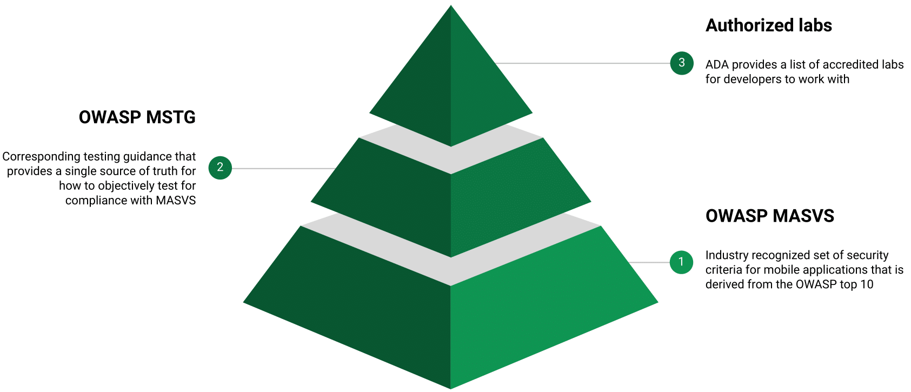

# App Defense Alliance
It is our mission to ensure the safety of the Google Play Store and the Android ecosystem.  The App Defense Alliance (ADA) is focused on protecting Android users by removing threats while improving app quality across the ecosystem. Click here for more information about the [App Defense Alliance](https://www.appdefensealliance.dev/) and other security initiatives.

# Mobile Application Security Assessment (MASA)
Mobile phones and apps usage has become ubiquitous. The average consumer spends over 3.5 hours a day using mobile applications, and has over 40 apps installed. Consumers worldwide will spend $34 billion on apps and games in Q3 2021, a 20% year-over-year increase on spending. However, app security continues to be a problem. For example, according to PT Securities, 76% of mobile apps have insecure data storage.  The App Defense Alliance is working to improve application security through third party security assessments based on industry standards, while providing transparency to consumers around the applications they are using.

The App Defense Alliance maintains a catalog of applications which have gone through 3rd party security assessments based on the OWASP Mobile Application Security Validation Standard. Specifically, the portions of the standard found in the [ADA Mobile Security Guide (MSG)](https://github.com/appdefensealliance/ASA/blob/main/MobileAppSecurityAssessment/MobileSecurityGuide.md). The MSG includes several optional items which developers may provide in their security assessment report, which is publicaly avaliable on the ADA product catalog.

This repository is maintained by the ADA approved security assessment companies. We encourage input through the issues page from both security assessors and developers. If you are interested in becoming an ADA approved security assessor, please visit [www.AppDefenseAlliance.dev](https://www.appdefensealliance.dev/)

# OWASP
The Open Web Application Security Project® (OWASP) is a nonprofit foundation that works to improve the security of software. Through community-led open-source software projects, hundreds of local chapters worldwide, tens of thousands of members, and leading educational and training conferences, the OWASP Foundation is the source for developers and technologists to secure the web.

For more information, please visit www.owasp.org.

# MASVS and MSTG
The Mobile Application Security Validation Standard (MASVS) is a community effort to establish a framework of security requirements needed to design, develop and test secure mobile apps on iOS and Android. These security requirements are mapped onto eight core areas ranging from Applicaiton Architecture and threat modeling, Data Storage and Privacy, to Securing the communications between the applciation and both local and remote connections. This standard is maintained by OWASP and can be found at this [link](https://github.com/OWASP/owasp-masvs).

The Mobile Security Testing Guide (MSTG) is a comprehensive manual for mobile app security testing and reverse engineering for iOS and Android mobile security testers based on the MASVS. The MSTG is a sister project to the MASVS and provides the testing details and acceptance requirements for each of the MASVS requirements. The MSTG is maintained by OWASP and can be found at this [link](https://github.com/OWASP/owasp-mstg).
