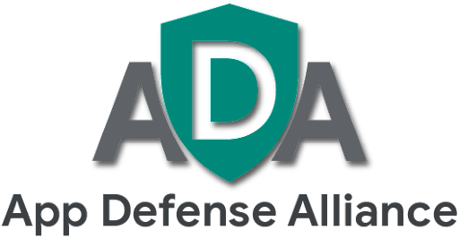

#

## Mobile Application Security Assessment 1.4-1.4

## Final

January 2022

# Frontispiece

## Version History

| Version | Date | Description |
| ------ | ------ | --------------- |
| 1.0 | 12/1/2021 | Initial release based on OWASP MASVS version 1.3 and MSTG version 1.2 |
| 1.1 | 1/11/2022 | No change to ADA specifications. OWASP MASVS updated to version 1.4 and MSTG updated to version 1.3 |
| 1.4-1.4 | 2/8/2022 | No change to ADA specifications. No change to OWASP MASVS.  MSTG updated to version 1.4 |

## Copyright and License

Version 1.4-1.4, January 2022

Copyright © 2022 Google. This work is licensed under the Creative Commons Attribution-ShareAlike 3.0 Unported License. To view a copy of this license, visit http://creativecommons.org/licenses/by-sa/3.0/ or send a letter to Creative Commons, PO Box 1866, Mountain View, CA 94042, USA.

This document includes material from [OWASP Mobile Application Security Validation Standard](https://github.com/OWASP/owasp-masvs) and [OWASP Mobile Security Testing Guide](https://github.com/OWASP/owasp-mstg) both released under the Creative Commons Attribution ShareAlike 3.0 license.

## Major Contributors

|                	|                	|                   	|
|----------------	|----------------	|-------------------	|
| DEKRA 	| Leviathon Security | NCC Group    	|
| NowSecure 	|      	|  	|

